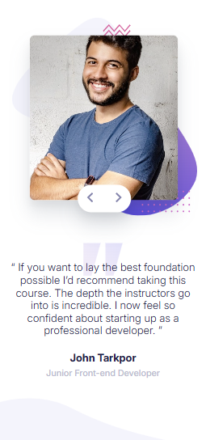
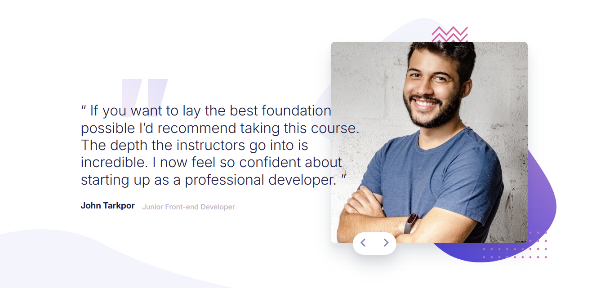

# Frontend Mentor - Coding bootcamp testimonials slider solution

This is a solution to the [Coding bootcamp testimonials slider challenge on Frontend Mentor](https://www.frontendmentor.io/challenges/coding-bootcamp-testimonials-slider-4FNyLA8JL). Frontend Mentor challenges help you improve your coding skills by building realistic projects. 

## Table of contents

  - [The challenge](#the-challenge)
  - [Screenshot](#screenshot)
  - [Links](#links)
  - [Built with](#built-with)
  - [What I learned](#what-i-learned)
  - [Continued development](#continued-development)
  - [Useful resources](#useful-resources)
  - [AI Collaboration](#ai-collaboration)
- [Author](#author)
- [Acknowledgments](#acknowledgments)

### The challenge

Users should be able to:

- View the optimal layout for the component depending on their device's screen size
- Navigate the slider using either their mouse/trackpad or keyboard

### Screenshot




### Links

- Solution URL: [Add solution URL here](https://github.com/nouranelfar/Testimonials-Slider)
- Live Site URL: [Add live site URL here](https://nouranelfar.github.io/Testimonials-Slider/)

### Built with

- Semantic HTML5 markup
- CSS custom properties
- Flexbox
- CSS Grid
- Mobile-first workflow
- [sass](https://sass-lang.com/) - For styles

### What I learned

```js
const proudOfThisFunc = () => {
document.addEventListener("keydown",(e)=>{
    if(e.key === "ArrowRight"){
        nextUser();
    }

    if(e.key === "ArrowLeft"){
        prevUser();
    }
})
}
```

### Useful resources

- [responsive images](https://web.dev/learn/design/responsive-images?hl=ar) - This helped me for responsive images.
- [javascript info](https://javascript.info/) - This is an amazing article which helped me understand java script basics.
- [sass] (https://sass-lang.com/guide/) - this helped me styling with saas.


### AI Collaboration

- What tools did i use ? (ChatGPT)
- How did you i them ? (debugging)

## Author

- Frontend Mentor - [@nouranelfar](https://www.frontendmentor.io/profile/nouranelfar)
- linkedIn - [nouran elfar] (https://www.linkedin.com/in/nouran-elfar-b5a0a3362/)
